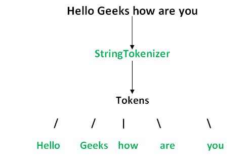
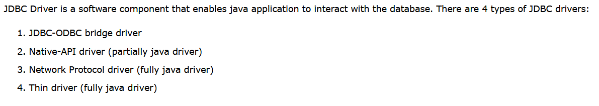
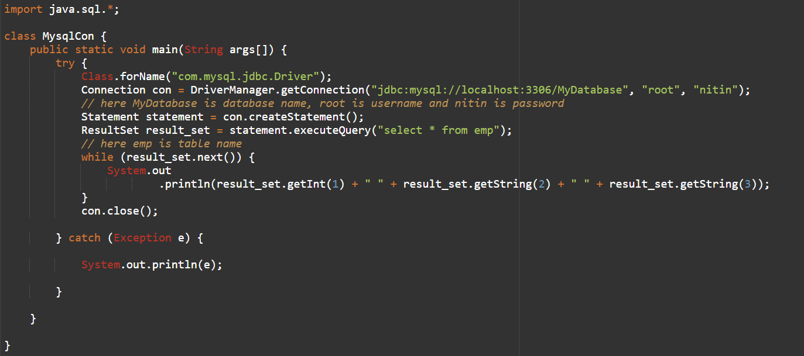

<h1> JDK vs JRE vs JVM </h1>
<ul>
  <li>
    <a href="https://www.geeksforgeeks.org/differences-jdk-jre-jvm/" > Lesson </a>
  </li>
</ul>
 

<h1>Fundamentals of Java</h1>
<ul>
  <li>
    <a href="https://youtu.be/rV_3Lewxx6o" > Lesson </a>
  </li>
</ul>
 

<h1>var keyword in Java</h1>
<i>The var keyword was introduced in Java 10. Type inference is used in var keyword in which it detects automatically the datatype of a variable based on the surrounding context.</i>

<ul>
  <li>
    <a href="https://www.geeksforgeeks.org/var-keyword-in-java/" > Lesson </a>
  </li>
</ul>
 

<h1>Command Line Arguments</h1>
<ul>
  <li>
    <a href="https://youtu.be/4H34eumdAZY" > Lesson 1</a>
  </li>
  <li>
    <a href="https://www.geeksforgeeks.org/command-line-arguments-in-java/" > Lesson 2</a>
  </li>
</ul>
 

<h1>String vs StringBuffer vs StringBuilder</h1>

<ul>
  <li>
    <a href="https://youtu.be/EQ85-lF_jrs" > Lesson </a>
  </li>
</ul>
 

<h1>StringTokenizer</h1>

<ul>
  <li>
    <a href="https://docs.oracle.com/javase/7/docs/api/java/util/StringTokenizer.html" > Lesson </a>
  </li>
</ul>
 

<h1>OOPS</h1>
 

 

 

 

<h1> Interfaces</h1>
 
<ul>
  <li>
    <a href="https://www.youtube.com/embed/zSX7N5MolB8" > Lesson</a>
  </li>
</ul>
 

 

 

<h1>Abstract Keyword| Abstract Classes | Abstract Method</h1>
<ul>
  <li>
    <a href="https://www.javatpoint.com/abstract-keyword-in-java#:~:text=The%20abstract%20keyword%20is%20used,create%20abstract%20class%20and%20method.&text=However%2C%20it%20may%20also%20contain,known%20as%20an%20abstract%20method." > Lesson 1</a>
  </li>
  <li>
    <a href="https://youtu.be/bIQMuFPgKpM" > Lesson 2</a>
  </li>
   <li>
    <a href="https://youtu.be/4rkPvf6hlIA" > Lesson 3</a>
  </li>
  
  
  
</ul>
 

<h1>Wrapper Classes</h1>
<i>The abstract keyword is used to achieve abstraction in Java. It is a non-access modifier which is used to create abstract class and method.
 
The role of an abstract class is to contain abstract methods. However, it may also contain non-abstract methods. The method which is declared with abstract keyword and doesn't have any implementation is known as an abstract method.
</i>
<ul>
  <li>
    <a href="https://youtu.be/Q0NVRQP1Z5g" > Lesson </a>
  </li>
</ul>
 

<h1>Autoboxing | Unboxing | Auto-Widening or Automatic Type Conversion </h1>
 
<ul>
  <li>
    <a href="https://www.geeksforgeeks.org/autoboxing-unboxing-java/" >Lesson 1</a>
  </li>
  <li>
    <a href="https://www.geeksforgeeks.org/type-conversion-java-examples/" >Lesson 2</a>
  </li>
  
</ul

 
<h1>Garbage Collection</h1>
<ul>
  <li>
    <a href="https://youtu.be/eUpSuBudnKY" > Lesson 1</a>
  </li>
  
  <li>
    <a href="https://youtu.be/e5TINddM-GM?list=PLX9Zi6XTqOKQ7TdRz0QynGIKuMV9Q2H8E"> Lesson 2</a>
  </li>
</ul>
 

<h1> Threads </h1>
 
<ul>
  <li>
     <a href="https://www.youtube.com/embed/YDH7f9dTXAs?list=PLu0W_9lII9agS67Uits0UnJyrYiXhDS6q" >Lesson 1</a>
 </li>
  <li>
    <a href="https://www.youtube.com/embed/b_h4-_j6JmY?list=PLu0W_9lII9agS67Uits0UnJyrYiXhDS6q" > Lesson 2</a>
  </li>
  <li>
     <a href="https://www.youtube.com/embed/7wpFNKnCpiQ?list=PLu0W_9lII9agS67Uits0UnJyrYiXhDS6q" > Lesson 3</a>
 </li>
  <li>
     <a href="https://www.youtube.com/embed/9O9tTS6LseI?list=PLu0W_9lII9agS67Uits0UnJyrYiXhDS6q" > Lesson 4</a>
 </li>
  <li>
     <a href="https://www.youtube.com/embed/DAHHFj39RRY?list=PLu0W_9lII9agS67Uits0UnJyrYiXhDS6q" > Lesson 5</a>
 </li>
 <li>
     <a href="https://www.youtube.com/embed/0s46eRixwnk?list=PLu0W_9lII9agS67Uits0UnJyrYiXhDS6q" > Lesson 6</a>
 </li>
 <li>
     <a href="https://www.youtube.com/embed/rVDWb0stlfQ?list=PLu0W_9lII9agS67Uits0UnJyrYiXhDS6q"> Lesson 7</a>
 </li>
 
</ul>
 
<h1>Generics</h1>

 
<ul>
  <li>
    <a href="https://youtu.be/_CRxUYxlFTo" > Lesson 1</a>
  </li>
  <li>
    <a href="https://youtu.be/dEOYASL9sD0" > Lesson 2</a>
  </li>
</ul>
<h1> JDBC </h1>
 
<ul>
  <li>
    <a href="https://www.youtube.com/embed/1r4UfkjARTA" >Lesson 1</a>
  </li>
  <li>
    <a href="https://www.javatpoint.com/jdbc-driver" >Lesson 2</a>
  </li>
</ul>
 

 

 
<dl>
  <dt>DriverManager class</dt>
  <dd>The DriverManager class acts as an interface between user and drivers. It keeps track of the drivers that are available and handles establishing a connection between a database and the appropriate driver. The DriverManager class maintains a list of Driver classes that have registered themselves by calling the method DriverManager.registerDriver(). </dd>
  
  <dt>Connection interface</dt>
  <dd>A Connection is the session between java application and database.A connection (session) with a specific database. SQL statements are executed and results are returned within the context of a connection.</dd>
  
  <dt>Statement interface</dt>
  <dd>The Statement interface provides methods to execute queries with the database. The statement interface is a factory of ResultSet i.e. it provides factory method to get the object of ResultSet.</dd>
  
  <dt>ResultSet interface</dt>
  <dd>A ResultSet object maintains a cursor pointing to its current row of data. Initially the cursor is positioned before the first row. The next method moves the cursor to the next row, and because it returns false when there are no more rows in the ResultSet object, it can be used in a while loop to iterate through the result set. </dd>
  
  <dt>PreparedStatement interface</dt>
  <dd>Improves performance: The performance of the application will be faster if you use PreparedStatement interface because query is compiled only once.</dd>
</dl>

<h1> Regular Expressions </h1>
 
<i>
  Regular Expressions or Regex (in short) is an API for defining String patterns that can be used for searching, manipulating and editing a string in Java. Email validation and passwords are few areas of strings where Regex are widely used to define the constraints. Regular Expressions are provided under java.util.regex package. This consists of 3 classes and 1 interface.
</i>
 
<i>
  The java.util.regex package primarily consists of the following three classes
</i>
<table>
<tr>
  <td>Class
  </td>
  <td>Description
  </td>
</tr>
  
  <tr>
  <td>util.regex.Pattern
  </td>
  <td>Used for defining patterns
  </td>
</tr>

<tr>
  <td>util.regex.Matcher
  </td>
  <td>Used for performing match operations on text using patterns
  </td>
</tr>

<tr>
  <td>PatternSyntaxException
  </td>
  <td>Used for indicating syntax error in a regular expression pattern
  </td>
</tr>
</table>

<ul>
  <li>
    <a href="https://www.geeksforgeeks.org/regular-expressions-in-java/" >Lesson</a>
  </li>
</ul>

<h1> Errors V/s Exceptions </h1>
 
 
<ul>
  <li>
    <a href="https://www.geeksforgeeks.org/errors-v-s-exceptions-in-java/" >Lesson 1</a>
  </li>
  <li>
    <a href="https://youtu.be/yxdu-Xs9ncY" >Lesson 2</a>
  </li>
  <li>
    <a href="https://youtu.be/aaWtYyqm8pI" >Lesson 3</a>
  </li>
</ul>

<h1> Packages in java using CMD </h1>
 
<ul>
  <li>
    <a href="https://youtu.be/uIyLyqmhzbM" >Lesson</a>
  </li>
  
</ul>
<h1> Packages in java using IDE </h1>
 
<ul>
  <li>
    <a href="https://youtu.be/ZunFumWa-ZU" >Lesson</a>
  </li>
  
</ul

