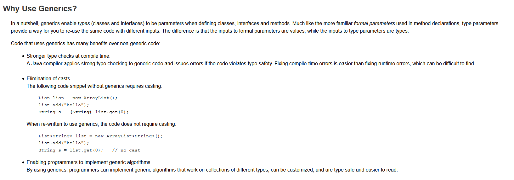

## OOPS
 

 

 

 

<h1> Interfaces</h1>
 
<ul>
  <li>
    <a href="https://www.youtube.com/embed/zSX7N5MolB8" > Lesson</a>
  </li>
</ul>
 

 

 

<h1> Threads </h1>
 
<ul>
  <li>
     <a href="https://www.youtube.com/embed/YDH7f9dTXAs?list=PLu0W_9lII9agS67Uits0UnJyrYiXhDS6q" >Lesson 1</a>
 </li>
  <li>
    <a href="https://www.youtube.com/embed/b_h4-_j6JmY?list=PLu0W_9lII9agS67Uits0UnJyrYiXhDS6q" > Lesson 2</a>
  </li>
  <li>
     <a href="https://www.youtube.com/embed/7wpFNKnCpiQ?list=PLu0W_9lII9agS67Uits0UnJyrYiXhDS6q" > Lesson 3</a>
 </li>
  <li>
     <a href="https://www.youtube.com/embed/9O9tTS6LseI?list=PLu0W_9lII9agS67Uits0UnJyrYiXhDS6q" > Lesson 4</a>
 </li>
  <li>
     <a href="https://www.youtube.com/embed/DAHHFj39RRY?list=PLu0W_9lII9agS67Uits0UnJyrYiXhDS6q" > Lesson 5</a>
 </li>
 <li>
     <a href="https://www.youtube.com/embed/0s46eRixwnk?list=PLu0W_9lII9agS67Uits0UnJyrYiXhDS6q" > Lesson 6</a>
 </li>
 <li>
     <a href="https://www.youtube.com/embed/rVDWb0stlfQ?list=PLu0W_9lII9agS67Uits0UnJyrYiXhDS6q"> Lesson 7</a>
 </li>
 
</ul>
 
<h1>Generics</h1>

 
<h1> JDBC </h1>
 
<ul>
  <li>
    <a href="https://www.youtube.com/embed/1r4UfkjARTA" >Lesson</a>
  </li>
</ul>

